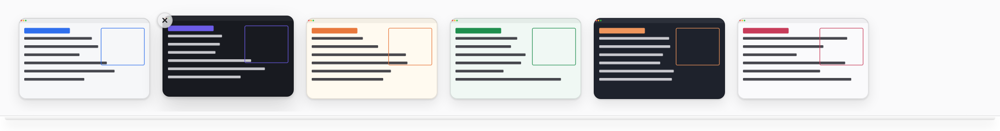

# Ledge

A shelf for your screenshots along the top of the screen. Out of the way until you reach for it.

<picture>
  <source media="(prefers-color-scheme: dark)" srcset="docs/ledge-dark.png">
  
</picture>

Every screenshot you take lands on the ledge. Rest the pointer against the top edge of the screen and it slides down; move away and it tucks itself back up. Grab what you need and get on with your work.

Runs on macOS, Windows and Linux. Built with Electron, React and TypeScript.

## Using it

| Gesture | What happens |
| :-- | :-- |
| Rest the pointer at the top edge | The ledge slides down on that screen |
| <kbd>Cmd/Ctrl</kbd> <kbd>Alt</kbd> <kbd>L</kbd> | Show or hide the ledge |
| Click | Copy the image to the clipboard |
| Double-click | Open it in your default image app |
| Drag into another app or folder | Share or save a copy |
| Right-click | Show the file in Finder / Explorer |
| Click the × | Take it off the ledge |
| <kbd>Esc</kbd> | Tuck the ledge away |

The keyboard works too: <kbd>Tab</kbd> to a screenshot, <kbd>Enter</kbd> to copy, <kbd>Shift</kbd> <kbd>Enter</kbd> to open, <kbd>Delete</kbd> to remove.

## Settings

Everything lives in the tray / menu bar icon:

- **Choose Folder…** – the folder Ledge watches. By default it follows your system's screenshot location: the macOS capture location (Desktop unless you changed it), or `Pictures/Screenshots` on Windows and Linux.
- **Move New Screenshots into Ledge** – new captures are moved out of the watched folder into Ledge's own folder, so your Desktop stays clear. Screenshots Ledge moved go to the Trash when you take them off the ledge, so nothing is lost by accident.
- **Peek When a Screenshot Arrives** – the ledge drops down for a moment so you can see the capture landed.

The ledge keeps your 24 most recent screenshots.

## Private by design

No account, no analytics, and Ledge's code makes no network requests. It only reads the folder you point it at, and screenshots never leave your machine.

## Run from source

Requires Node.js 22 or later.

```sh
git clone https://github.com/himanshugupta-code/ledge.git
cd ledge
npm install
npm start
```

On macOS, the first time Ledge watches your Desktop the system asks for permission to access it.

```sh
npm test          # unit tests
npm run typecheck # main, preload, renderer and tests
npm run build     # compile to dist/
```

## How it works

| Path | Role |
| :-- | :-- |
| `src/main/main.ts` | App lifecycle, tray menu, global shortcut, IPC and the `ledge://` protocol |
| `src/main/ledgeWindow.ts` | The transparent strip window along the top of the screen |
| `src/main/watcher.ts` | Watches the screenshot folder and waits for files to finish writing |
| `src/core/reveal.ts` | The top-edge reveal logic as a pure state machine |
| `src/core/shelf.ts` | Adding, removing and limiting screenshots on the ledge |
| `src/preload/preload.ts` | The small, typed API the window is allowed to use |
| `src/renderer/` | The React UI |

The window runs sandboxed with context isolation. The UI and the thumbnails are served from a custom `ledge://` protocol that only hands out the app's own files and the screenshots currently on the ledge.

## Credits

Inspired by [Tendedero](https://github.com/alejandrobujan/tendedero) by Alejandro Buján, a lovely native macOS app built around the same idea. Ledge is an independent, cross-platform take on it with its own code and design.

## License

[MIT](LICENSE)
