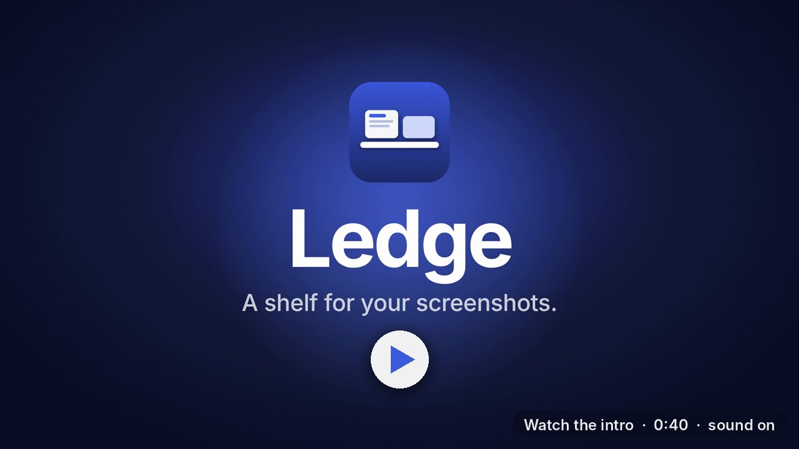
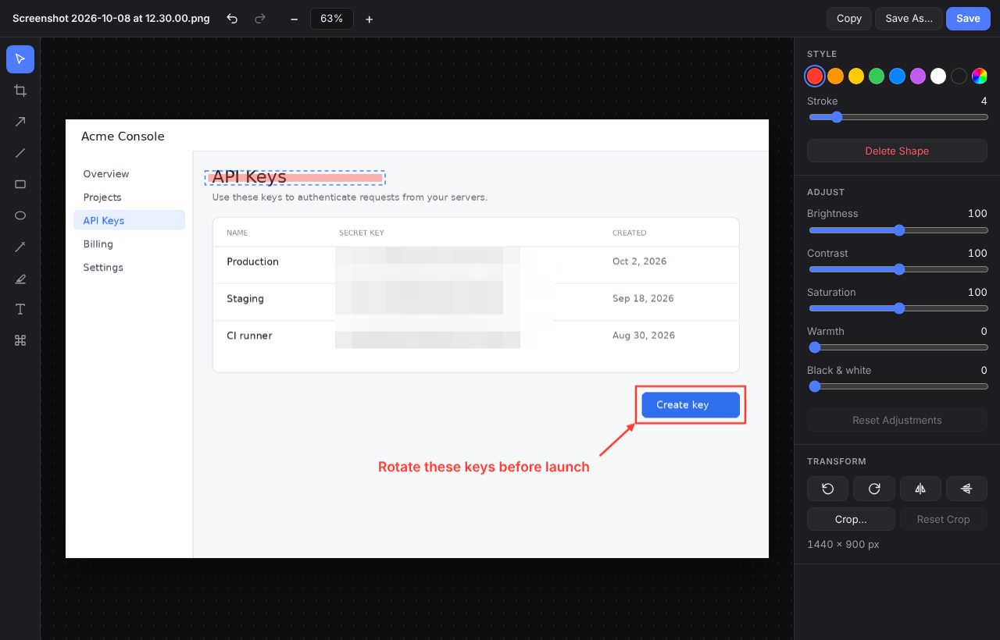

# Ledge

A shelf for your screenshots along the top of the screen. Out of the way until you reach for it.

<a href="docs/ledge-intro.mp4"></a>

<picture>
  <source media="(prefers-color-scheme: dark)" srcset="docs/ledge-dark.png">
  
</picture>

Every screenshot you take lands on the ledge. Rest the pointer against the top edge of the screen and it slides down; move away and it tucks itself back up. Grab what you need and get on with your work.

Runs on macOS, Windows and Linux. Built with Electron, React and TypeScript.

## Using it

| Gesture | What happens |
| :-- | :-- |
| Rest the pointer at the top edge | The ledge slides down on that screen |
| <kbd>Cmd/Ctrl</kbd> <kbd>Alt</kbd> <kbd>L</kbd> | Show or hide the ledge |
| Click | Open it in the editor |
| Copy button (top right of a card) | Copy the image to the clipboard |
| Drag into another app or folder | Share or save a copy |
| Right-click | Show the file in Finder / Explorer |
| Click the × | Take it off the ledge |
| <kbd>Esc</kbd> | Tuck the ledge away |

The keyboard works too: <kbd>Tab</kbd> to a screenshot, <kbd>Enter</kbd> to edit, <kbd>C</kbd> to copy, <kbd>Delete</kbd> to remove.

## Editing



Click any screenshot to open it in the editor.

- **Annotate** with arrows, lines, rectangles, ellipses, a pen, a highlighter and text. Hold <kbd>Shift</kbd> to draw straight lines at 45° steps, or squares and circles.
- **Pixelate** passwords, keys and personal details before you share a screenshot.
- **Adjust** brightness, contrast, saturation, warmth and black & white.
- **Crop, rotate and flip**, with your annotations moving along with the image.
- **Select** a shape to move it, recolor it or delete it. Everything can be undone.

**Save** writes an edited copy next to the original and puts it on the ledge; the original is never touched. **Save As…** lets you choose where, and **Copy** puts the result on the clipboard.

| Shortcut | Action |
| :-- | :-- |
| <kbd>V</kbd> <kbd>C</kbd> <kbd>A</kbd> <kbd>L</kbd> <kbd>R</kbd> <kbd>O</kbd> <kbd>P</kbd> <kbd>H</kbd> <kbd>T</kbd> <kbd>X</kbd> | Select, Crop, Arrow, Line, Rectangle, Ellipse, Pen, Highlighter, Text, Pixelate |
| <kbd>Cmd/Ctrl</kbd> <kbd>Z</kbd> · <kbd>Shift</kbd> <kbd>Cmd/Ctrl</kbd> <kbd>Z</kbd> | Undo · Redo |
| <kbd>Cmd/Ctrl</kbd> <kbd>C</kbd> · <kbd>S</kbd> · <kbd>Shift</kbd> <kbd>S</kbd> | Copy · Save · Save As |
| <kbd>Cmd/Ctrl</kbd> <kbd>+</kbd> · <kbd>−</kbd> · <kbd>0</kbd> | Zoom in · Zoom out · Fit |
| <kbd>Delete</kbd> | Delete the selected shape |
| <kbd>Enter</kbd> · <kbd>Esc</kbd> | Apply · Cancel a crop |

## Settings

Everything lives in the tray / menu bar icon:

- **Choose Folder…** – the folder Ledge watches. By default it follows your system's screenshot location: the macOS capture location (Desktop unless you changed it), or `Pictures/Screenshots` on Windows and Linux.
- **Move New Screenshots into Ledge** – new captures are moved out of the watched folder into Ledge's own folder, so your Desktop stays clear. Screenshots Ledge moved go to the Trash when you take them off the ledge, so nothing is lost by accident.
- **Peek When a Screenshot Arrives** – the ledge drops down for a moment so you can see the capture landed.

The ledge keeps your 24 most recent screenshots.

## Private by design

No account, no analytics, and Ledge's code makes no network requests. It only reads the folder you point it at, and screenshots never leave your machine.

## Run from source

Requires Node.js 22 or later.

```sh
git clone https://github.com/himanshugupta-code/ledge.git
cd ledge
npm install
npm start
```

On macOS, the first time Ledge watches your Desktop the system asks for permission to access it.

```sh
npm test          # unit tests
npm run typecheck # main, preload, renderer and tests
npm run build     # compile to dist/
```

## Build a DMG

On a Mac:

```sh
npm run dist:mac
```

This builds Ledge, packages it with electron-builder for your Mac's architecture, and saves `Ledge-<version>-<arch>.dmg` to your Downloads folder. Open the DMG and drag Ledge to Applications.

The app isn't signed with an Apple Developer ID yet, so the first time you open it macOS says it can't verify the developer. Right-click Ledge in Applications and choose **Open**, or allow it under **System Settings → Privacy & Security**. You only need to do this once.

## How it works

| Path | Role |
| :-- | :-- |
| `src/main/main.ts` | App lifecycle, tray menu, global shortcut, IPC and the `ledge://` protocol |
| `src/main/ledgeWindow.ts` | The transparent strip window along the top of the screen |
| `src/main/watcher.ts` | Watches the screenshot folder and waits for files to finish writing |
| `src/core/reveal.ts` | The top-edge reveal logic as a pure state machine |
| `src/core/shelf.ts` | Adding, removing and limiting screenshots on the ledge |
| `src/main/editorWindow.ts` | The editor window |
| `src/preload/preload.ts` | The small, typed API the windows are allowed to use |
| `src/renderer/` | The React UI for the ledge |
| `src/renderer/editor/model.ts` | The editor document: shapes, rotate/flip/crop math, hit-testing and undo history |
| `src/renderer/editor/render.ts` | Draws the adjusted image, annotations and pixelation onto a canvas |
| `src/renderer/editor/EditorApp.tsx` | The editor UI |

Every window runs sandboxed with context isolation. The UI and the screenshots are served from a custom `ledge://` protocol that only hands out the app's own files and the screenshots currently on the ledge, and the editor can only hand back PNG data, which the app writes next to the original.

## Credits

Inspired by [Tendedero](https://github.com/alejandrobujan/tendedero) by Alejandro Buján, a lovely native macOS app built around the same idea. Ledge is an independent, cross-platform take on it with its own code and design.

## License

[MIT](LICENSE)
